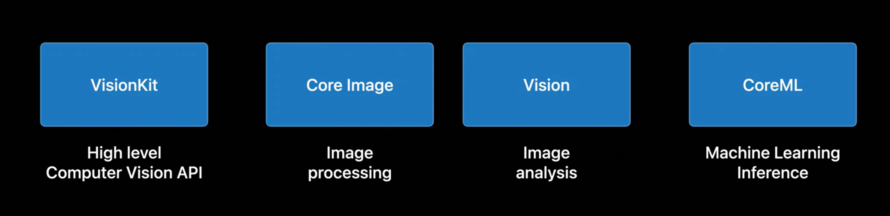
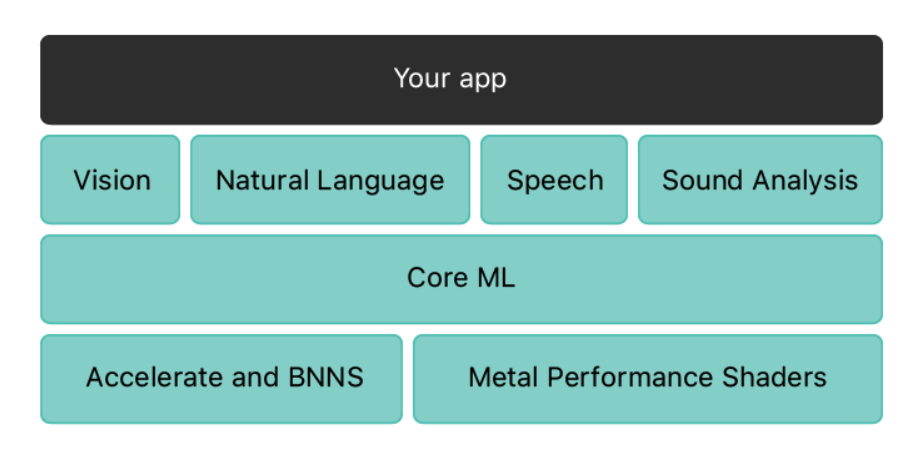
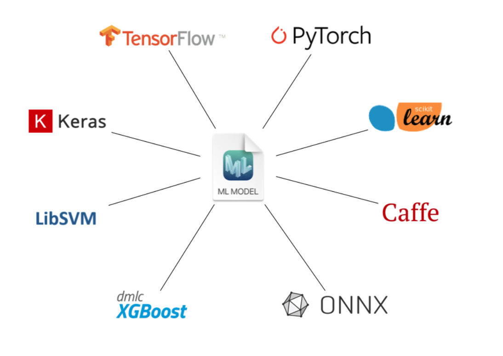
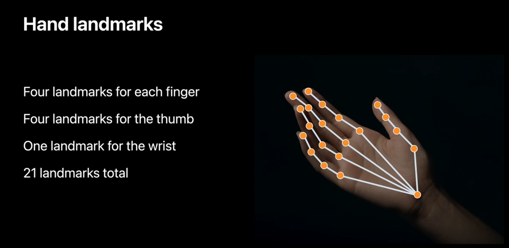
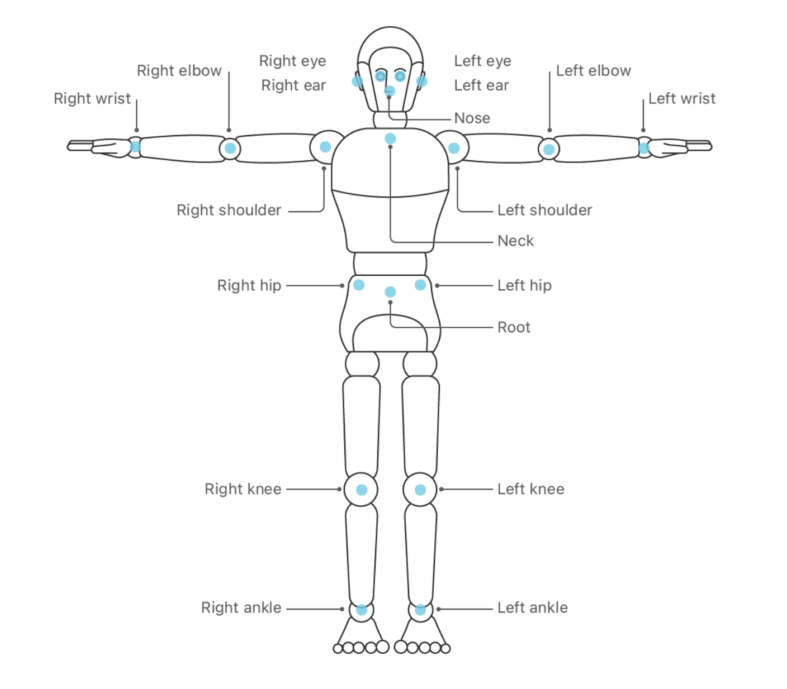
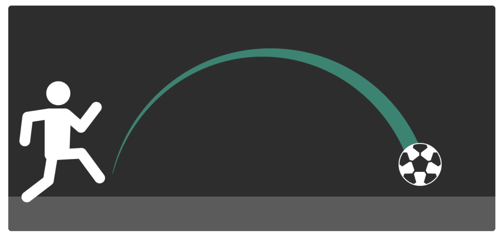
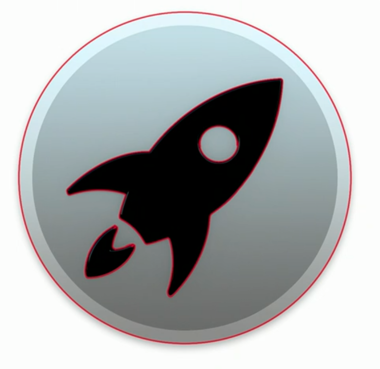
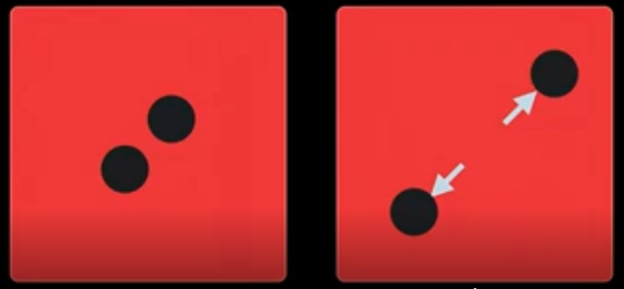
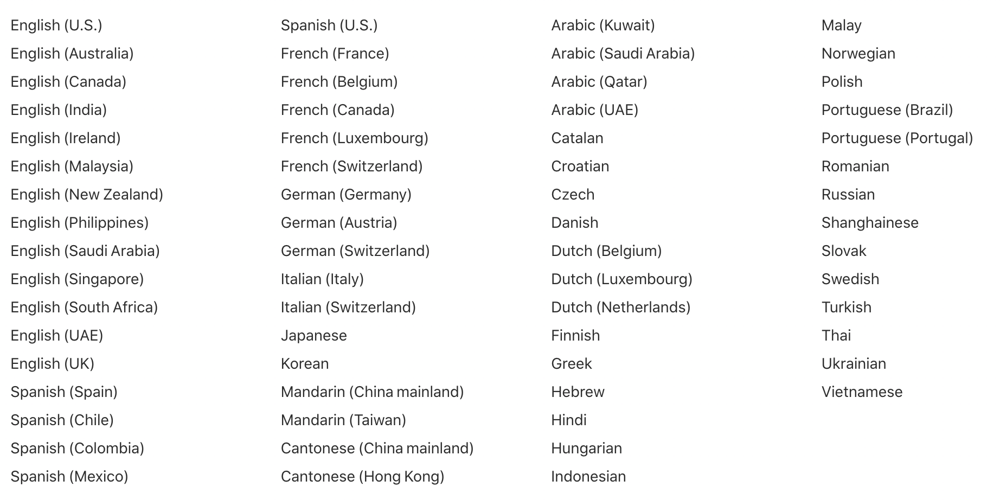

# Apple's Machine Learning

## Purpose

* The performance of the device has been enhanced.
* iOS 14 added several new features
* To know what it has provided for further usage


## Outlines

* Going through all the ML features that Apple provided so far. 
* Introducing some core features


## Computer Vision frameworks



## Natural Language Processing frameworks

* Vision
* Speech
* SoundAnalysis

## Core ML

### What does Core ML provide

* Run models fully on-device
* Convert models to Core ML
* Run advanced neural networks
* Personalize models on-device
* Deploy models by CloudKit
* Encrypt models

### Architecture



* [BNNS](https://developer.apple.com/documentation/accelerate/bnns) is the subset of Accelerate framework, it provides a collection of functions that you use to construct neural networks for training and inference via CPU's vector processor

* [Metal Performance Shaders](https://developer.apple.com/documentation/metalperformanceshaders)

### Models

* Core ML Models
* Create ML
* Turi Create
* Core ML Tools
* Metal Performance Shaders (MPS)

#### Core ML Models

The following popular models are provided by Apple in its [website](https://developer.apple.com/machine-learning/models/) so far.

* FCRN-DepthPrediction
* MNIST
* UpdatableDrawingClassifier
* MobileNetV2
* Resnet50
* SqueezeNet
* DeeplabV3
* YOLOv3
* YOLOv3-Tiny
* PoseNet
* BERT-SQuAD

#### Create ML

Create machine learning models for use in your app.

* Create Core ML models easily
* Model previews
* On-device training
* eGPU training support

##### Provide Model types 

* Image
	* Image classification
	* Object detection
	* Style transfer
* Video
	* Action classification [WWDC video](https://developer.apple.com/videos/play/wwdc2020/10043/)
		it is also a classification task and powered by body pose estimation and Human body actions
	* Style transfer 
* Motion
	* Activity classification
* Sound
	* Sound classfication
* Text
	* Text classification
	* Word tagging
* Tabular
	* Tabular classification
	* Tabular regression
	* Recommendation

#### Turi Create

Apple provides a open source toolkits for creating Core ML models via Python.

* [Documentation](https://apple.github.io/turicreate/docs/userguide/)
* [Github](https://github.com/apple/turicreate#documentation)

##### Supported ML scenarios 

* Recommender Systems
* Image Classification
* Drawing Classification
* Sound Classification
* Image Similarity
* Object Detection
* One-Shot Object Detection
* Style Transfer
* Activity Classifier
* Text Classifier

##### Machine learning essentials

* Classifiers
* Regression
* Graph analytics
* Clustering
* Nearest Neighbors
* Topic models

#### Core ML Tools

Use the coremltools Python package to convert models from third-party training libraries such as TensorFlow and PyTorch to the Core ML format.

* [github](https://github.com/apple/coremltools)



#### Metal Performance Shaders (MPS)

* MPS Graph (iOS 14)[WWDC2020](https://developer.apple.com/videos/play/wwdc2020/10677/)

## Vision

Some outstanding features:

* Still Image Analysis
	* [Detecting Objects in Still Images](https://developer.apple.com/documentation/vision/detecting_objects_in_still_images?language=objc)
* Image Sequence Analysis
	* VNSequenceRequestHandler 
* Saliency Analysis
	* [Cropping Images Using Saliency](https://developer.apple.com/documentation/vision/cropping_images_using_saliency?language=objc)
* Object Tracking
	* [Tracking the User’s Face in Real Time](https://developer.apple.com/documentation/vision/tracking_the_user_s_face_in_real_time?language=objc)
	* [Tracking Multiple Objects or Rectangles in Video](https://developer.apple.com/documentation/vision/tracking_multiple_objects_or_rectangles_in_video?language=objc)
* Rectangle Detection
* Face and Body Detection	
* Animal Detection
* Barcode Detection
* Text Detection
* Text Recognition
* Horizon Detection
* Image Alignment
* Object Recognition
* Hand Pose (iOS 14)



* Body Pose (iOS 14)



* Trajectory detection (iOS 14)



* Contour detection (iOS 14)



* Optical Flow (iOS 14)

Analyze the movement bwtween two frames, and tell how each pixel flow in X and Y




## Natural Language

The Natural Language framework provides a variety of natural language processing (NLP) functionality with support for many different languages and scripts. 

* [Tokenization](https://developer.apple.com/documentation/naturallanguage/tokenizing_natural_language_text) (iOS 12.0+)
	* Breaking up a piece of text into linguistic units or tokens such as words, sentences and paragraphs.
* [Language Identification](https://developer.apple.com/documentation/naturallanguage/identifying_the_language_in_text) (iOS 12.0+)
	* Automatically detecting the language of a piece of text.
* Linguistic Tags (iOS 12.0+)
	* [Identifying Parts of Speech,](https://developer.apple.com/documentation/naturallanguage/identifying_parts_of_speech) classify nouns, verbs, adjectives, and other parts of speech in a string.

		```swift
		func retrievePOS(from text: String) -> [String] {
	    let tagger = NLTagger(tagSchemes: [.lexicalClass])
	    tagger.string = text
	    
	    var tags = [String]()
	    let options: NLTagger.Options = [.omitPunctuation, .omitWhitespace]
	    tagger.enumerateTags(in: text.startIndex..<text.endIndex, unit: .word, scheme: .lexicalClass, options: options) { (tag, tokenRange) -> Bool in
	        if let tag = tag {
	            tags.append(tag.rawValue)
	        }
	        return true
	    }
	    return tags
		}
		
		let posTags = retrievePOS(from: "Loving someone is such a lovely feeling! I love it")
		print(posTags)
		
		// output: ["Verb", "Noun", "Verb", "Adjective", "Determiner", "Adjective", "Noun", "Pronoun", "Verb", "Pronoun"]
		```
	* [Named entity recognition](https://developer.apple.com/documentation/naturallanguage/identifying_people_places_and_organizations), identifying tokens as names of people, places, or organizations.
	* Lemmatization, the idea behind lemmatizing a word is turning both lover and loving into the same lemma: love.

		```swift
		import NaturalLanguage
	
		func retrieveLemmas(from text: String) -> [String] {
		    let tagger = NLTagger(tagSchemes: [.lemma])
		    tagger.string = text
		    
		    var tags = [String]()
		    let options: NLTagger.Options = [.omitPunctuation, .omitWhitespace]
		    tagger.enumerateTags(in: text.startIndex..<text.endIndex, unit: .word, scheme: .lemma, options: options) { (tag, tokenRange) -> Bool in
		        if let tag = tag {
		            tags.append(tag.rawValue)
		        }
		        return true
		    }
		    return tags
		}
		
		let lemmas = retrieveLemmas(from: "Loving someone is such a lovely feeling! I love it")
		print(lemmas)
		
		// output: ["love", "someone", "be", "such", "a", "lovely", "feeling", "I", "love", "it"]
		```
* Text Embedding (iOS 13.0+)
	* [Finding Similarities Between Pieces of Text.](https://developer.apple.com/documentation/naturallanguage/finding_similarities_between_pieces_of_text)
* Natural Language Models by Create ML (iOS 12.0+)
	* Custom word tagging
	* Custom text classification

## Speech

* Speech Recognition (iOS 10.0+)

Perform speech recognition on live or prerecorded audio. Always assume that performing speech recognition requires a network connection.

* Supported languages



## Sound

* Sound classification (iOS 13.0+)

Analyze streamed and file-based audio to classify it as a particular type. The framework performs its analysis using a Core ML model trained by an MLSoundClassifier


## Core Image

* Scaling
* Morphology Operations
* Noise Reduction
* Edge Detection
* Contrast enhance
* Binarization
* Comparing images
* Re-generating barcodes

## Alternatives

* Tensorflow Lite
* Pytorch Mobile

