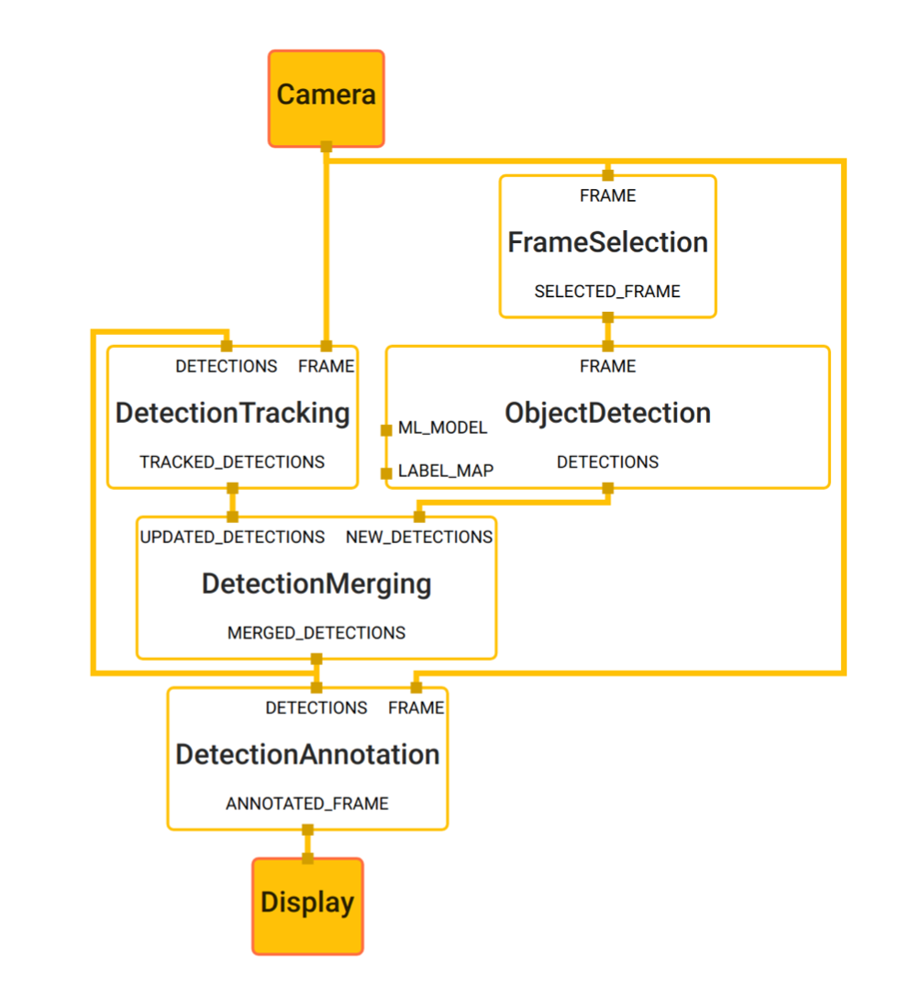
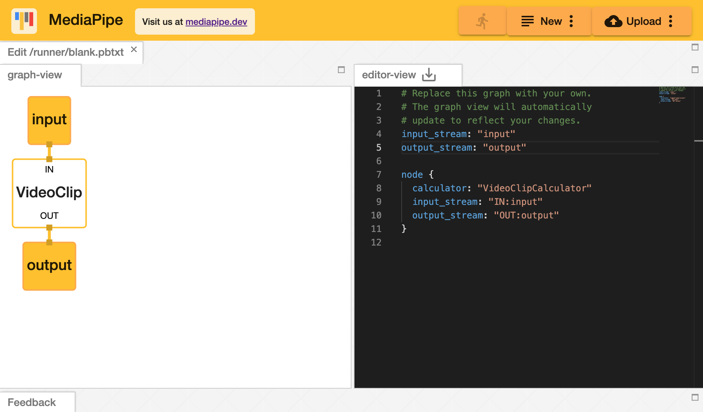
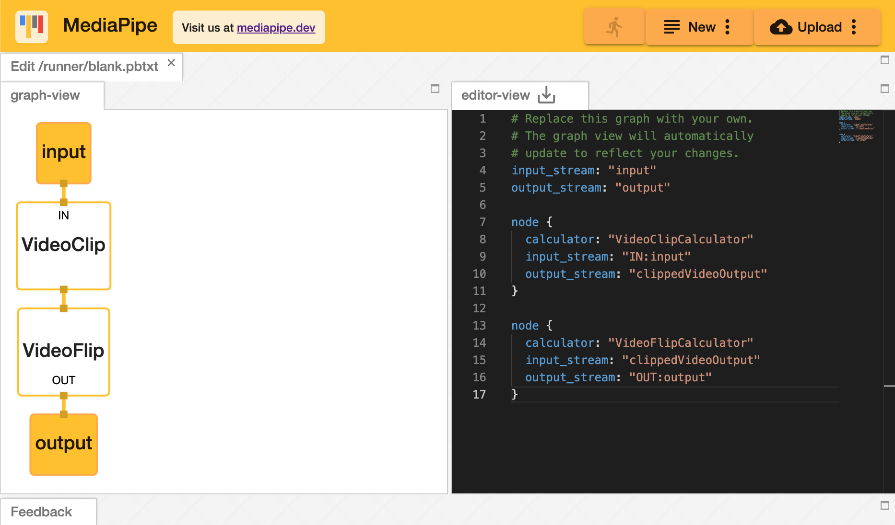

# MediaPipe - Google开源跨平台机器学习框架

MediaPipe是一款由Google开发并开源的流媒体数据处理的机器学习应用开发框架。它是一个基于图的框架，用于构建使用了多种形式的数据源，如视频、音频、传感器以及任何时间序列的数据的机器学习管道。 MediaPipe是跨平台的可以运行在嵌入式平台(树莓派等)，移动设备(iOS和Android)，工作站和服务器上，并支持移动端GPU加速。 使用MediaPipe，可以将机器学习管道构建为一个图形的模块化组件，包括推理模型和媒体处理功能。 

## 为什么需要MediaPipe

构建包含推理输出的应用程序所涉及的不仅仅是运行机器学习模型。开发者也必须做到一下几点：

+ 利用各种设备的功能
+ 平衡设备资源使用和推理结果的质量
+ 通过流水线并行运行多个操作
+ 并确保时间序列数据同步正确

MediaPipe框架解决了这些挑战。开发者可以使用MediaPipe轻松快速地将现有的和新的机器学习模型组合到原型中，并将其应用到完善的跨平台应用程序中。开发人员可以配置使用MediaPipe创建的应用程序做到如下几点：

+ 有效管理资源（CPU和GPU）达到低延迟性能
+ 处理诸如音频和视频帧之类的时间序列数据的同步
+ 并测量性能和资源消耗

这些功能使开发人员可以专注于算法或模型开发，并使用MediaPipe作为迭代改进其应用程序的环境，其结果可在不同的设备和平台上重现。 除了上述的特性，MediaPipe还支持TensorFlow 和 TF Lite的推理引擎，任何TensorFlow和TF Lite的模型都可以在MediaPipe上使用。同时，在移动端和嵌入式平台，MediaPipe也支持设备本身的 GPU 加速。

## MediaPipe介绍

在增强现实（AR）的应用程序中为了增强用户体验，程序会以高帧频处理诸如视频和音频之类的感官数据。 由于处理过程的的过度耦合和延时要求，很难修改这种应用程序以协调其他处理步骤和推理模型。 此外，为不同平台开发同样的应用程序也非常耗时，因为它通常涉及优化推理和处理步骤为了在目标设备上正确有效地运行。

MediaPipe通过将各个感知模型抽象化并将其连接到可维护的管道中来解决这些挑战。 借助MediaPipe，可以将感知管道构建为模块化组件的图形，包括例如推理处理模型和媒体处理功能。诸如音频和视频流之类的传感数据会进入图形，通过处理这些数据如物体检测数据或人脸点标注数据从图形输出。如下图所示MediaPipe的目标检测图：



在TensorFlow，PyTorch，CNTK或MXNet等项目中使用操作图来定义神经网络模型。但MediaPipe的图起到了补充作用，MediaPipe未定义神经网络的内部结构，而是指定了嵌入一个或多个模型的较大规模的管道。

## MediaPipe基本概念

MediaPipe有下面三个主要部分组成：

1. 用于感官数据进行推理的框架
2. 用于性能评估的一组工具
3. 可重用的推理和处理组件的集合

### 框架基本元素

MediaPipe的核心框架由C++实现，并提供Java以及Objective C等语言的支持。MediaPipe的主要概念包括：

+ 数据包(Packet) - 是最基础的数据单位，一个数据包代表了在某一特定时间节点的数据，例如一帧图像或一小段音频信号
+ 节点(Node) - 图中的节点，可以是下面的计算单元或子图。
+ 计算单元(Calculator) - 按照MeidaPipe协议实现的一个C++类，里面对数据包进行处理。
+ 子图(Subgraph) - 另外一个完整的图作为节点。
+ 数据流(Stream) - 是由按时间顺序升序排列的多个数据包组成，一个数据流的某一特定时间戳只允许至多一个数据包的存在，如采集的视频帧可以看做一个数据流。
+ 图(Graph) - 是有向的图，数据包从数据源(Graph Input Stream)流入图直至在输出结点(Graph Output Stream)离开。
+ 图配置(GraphConfig) - 是描述图的拓扑和功能的配置文件。 

MediaPipe开源了多个由谷歌内部团队实现的计算单元的同时，也向用户提供定制新计算单元的接口。创建一个新的计算单元，需要用户继承CalculatorBase类并实现Open，Process，Close方法去分别定义计算单元的初始化方法，数据流的处理方法，以及在计算单元完成所有运算后的关闭步骤。为了方便用户在多个图中复用已有的通用组件，例如图像数据的预处理、模型的推理以及图像的渲染等，MediaPipe引入了子图(Subgraph)的概念。因此，一个MediaPipe图中的节点既可以是计算单元，亦可以是子图。子图在不同图内的复用，方便了大规模模块化的应用搭建。

图是一个有向的数据流图，数据流经计算单元，开发者可以自定义计算单元。 图形描述通过GraphConfig协议指定的，然后使用Graph对象运行。
可以通过更新GraphConfig文件来更改添加或删除组件的管道。 开发者还可以在这个文件里配置全局级别设置，以修改图的执行和资源消耗。 这对于调整不同平台（例如台式机和移动设备）上图形的性能非常有用。

## 可视化图编辑器

MediaPipe提供了[MediaPipe Visualizer](https://viz.mediapipe.dev/)在线工具，它帮助用户了解其计算单元图形的结构并了解其机器学习推理管道的整体行为。图形视图允许用户在编辑器中直接修改或上传图形配置文件加载到编辑器，有一个视频剪切计算单元的图如下所示：



可以看到图显示在左边区域它是一个只读区域，通过鼠标可以缩放并拖动图像但不能编辑。右边是文本编辑区可以添加或编辑代码来修改图，这里的代码就是GraphConfig，它可以被保存为一个文本文件然后通过Graph的API来加载这个图。下面的代码是我们又添加一个Video Flip的计算单元。更新后的图如下所示：

```
input_stream: "input"
output_stream: "output"

node {
  calculator: "VideoClipCalculator"
  input_stream: "IN:input"
  output_stream: "clippedVideoOutput"
}

node {
  calculator: "VideoFlipCalculator"
  input_stream: "clippedVideoOutput"
  output_stream: "OUT:output"
}
```




## 目前开源基于MediaPipe实现的实例

+ 人脸侦测(Face Detection)
+ 多手追踪(Multi-hand Tracking)
+ 单手追踪(Hand Tracking)
+ 头发(Hair Segmentation）
+ 物体识别(Object Detection)
+ 物体识别并追踪(Object Detection and Tracking)
+ 自动视频裁剪(AutoFlip)

## 物体识别实现


