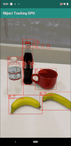
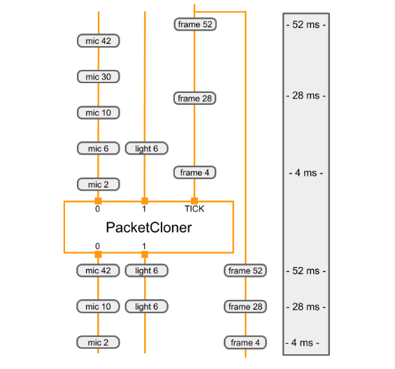
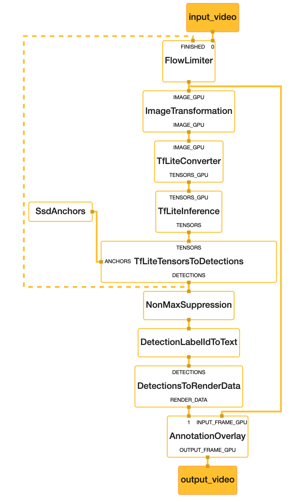

# MediaPipe - 跨平台机器学习应用开发框架

MediaPipe是一款由Google开发并开源的数据流处理机器学习应用开发框架。它是一个基于图的数据处理管线，用于构建使用了多种形式的数据源，如视频、音频、传感器数据以及任何时间序列数据。 MediaPipe是跨平台的，可以运行在嵌入式平台(树莓派等)，移动设备(iOS和Android)，工作站和服务器上，并支持移动端GPU加速。 使用MediaPipe，可以将机器学习任务构建为一个图形的模块表示的数据流管道，可以包括推理模型和流媒体处理功能。 

## 为什么需要MediaPipe

构建包含推理的应用程序所涉及的不仅仅是运行机器学习推理模型。开发者还需要做到以下几点：

+ 利用各种设备的功能
+ 平衡设备资源使用和推理结果的质量
+ 通过流水线并行运行多个操作
+ 确保时间序列数据同步正确

MediaPipe框架解决了这些挑战，开发者可以使用它轻松快速地将现有的或新的机器学习模型组合到以图表示的原型中，并将其跨平台实现。开发人员可以配置使用MediaPipe创建的应用程序做到如下几点：

+ 有效管理资源(CPU和GPU)达到低延迟性能
+ 处理诸如音频和视频帧之类的时间序列数据的同步
+ 并测量性能和资源消耗

如在增强现实(AR)的应用程序中为了增强用户体验，程序会以高帧频处理诸如视频和音频之类的感官数据。 由于处理过程的的过度耦合和低延时要求，很难按照常规应用程序开发方式协调数据处理步骤和推理模型。 此外，为不同平台开发同样的应用程序也非常耗时，它通常涉及优化推理和处理步骤以便在目标设备上正确高效地运行。

MediaPipe通过将各个感知模型抽象为模块并将其连接到可维护的图中来解决这些问题。借助MediaPipe，可以将数据流处理管道构建为模块化组件图，包括推理处理模型和媒体处理功能。将视频和音频流数据输入到图中，通过各个功能模块构建的图模型管道处理这些数据，如物体检测或人脸点标注等最后结果数据从图输出。

这些功能使开发者可以专注于算法或模型开发，并使用MediaPipe作为迭代改进其应用程序的环境，其结果可在不同的设备和平台上重现。除了上述的特性，MediaPipe还支持TensorFlow和TF Lite的推理引擎，任何TensorFlow和TF Lite的模型都可以在MediaPipe上使用。同时在移动端和嵌入式平台，MediaPipe也支持设备本身的GPU加速。

下图是基于MediaPipe构建的的目标检测图：


从图中各个模块的名字可以看出个模块的功能，输入是摄像头采集的视频数据帧通过图中各个模块的处理输出到显示屏上。下图是手机运行效果：



## MediaPipe介绍

MediaPipe有下面三个主要部分组成：

1. 用于构建基于感官数据进行机器学习推理的框架
2. 用于性能评估的工具
3. 可重用的推理和处理组件的集合

### 基本概念

MediaPipe的核心框架由C++实现，并提供Java以及Objective-C等语言的支持。MediaPipe的主要概念包括：

+ 图(Graph) - 有向的图，如上图所示，数据由Camera送入图，由Dispaly输出。
+ 数据包(Packet) - 最基础的数据单位，一个数据包代表了在某一特定时间节点的数据，上图中一帧图像为一个数据包。
+ 节点(Node) - 图中的节点，可以是下面的计算单元或子图，上图中每个黄色的矩形是一个节点。
+ 数据流(Stream) - 由按时间顺序升序排列的多个数据包组成，数据流的某一特定时间戳只允许至多一个数据包的存在，如采集的连续视频帧可以看做一个连续数据流，数据流从输入流经各个节点输出流出，上图的黄线就是数据流。
+ 图配置(GraphConfig) - 描述图的拓扑和功能的配置信息，上图就对应一个配置描述。
+ 计算单元(Calculator) - 按照MeidaPipe协议实现的一个C++类，里面对数据包进行处理，它作为一个节点，上图的黄框就是一个计算单元。
+ 子图(Subgraph) - 也是一个节点，子图内又包含了一个完整的图，上图的黄框可以是一个子图。

这些概念中主要是图和计算单元，它们是MediaPipe运行的核心，下面会重点说明它们。

MediaPipe已经包含了多个由Google实现的计算单元，也向用户提供定制新计算单元的基类。并且子图的概念是为了方便用户在多个图中复用已有的通用组件，例如图像数据的预处理、模型的推理以及图像的渲染等，因此一个MediaPipe图中的节点既可以是计算单元，亦可以是子图。子图在不同图内的复用，方便了大规模模块化的应用搭建。

可以看出图是一个有向的数据流管线，一个数据包从数据源进入，然后按照数据流线路流经各个节点直到输出结点完成。

图结构描述通过GraphConfig指定，它通过一个文件的形式存在可以被Graph加载运行，我们可以通过更新GraphConfig配置文件来添加，删除或更改组件的连接。我们还可以在这个文件里配置全局级别设置，以修改图的执行和资源消耗，这对于调整不同平台（例如台式机和移动设备）上的性能非常有用。

另外在TensorFlow，PyTorch，CNTK或MXNet等项目中使用图来定义神经网络模型。但MediaPipe的图起到了补充作用，MediaPipe未定义神经网络的内部结构，而是指定了嵌入一个或多个模型的较大规模的处理图。

### 计算单元

计算单元是一个C++类，创建一个计算单元需要用户继承于CalculatorBase类并实现GetContract, Open, Process, Close方法去分别定义计算单元的初始化，数据流的处理，以及在计算单元完成所有运算后的关闭步骤。

假设有一个场景，里面有摄像机，麦克风和光传感器在采集数据并要处理。每个传感器都独立运行，并且按照各自的采样率采集数据，由于各个传感器的采样率不同它们收集并发送数据就不会同步。假如每个传感器的采集输出为：

+ 摄像机 - 房间的RGB图像帧(ImageFrame)
+ 麦克风 - 房间中声音的分贝(整数)
+ 光线传感器 - 房间的亮度(整数)

我们的应用要处理来自这3个传感器的数据，当然不是每个传感器有数据到来就处理，我们要在摄像机的图像帧数据到来时与最后一次收集的麦克风数据和光传感器数据作为一帧数据一起进行处理。这里我们就需要一个计算单元来完成这个同步工作。在MediaPipe中提供了PacketClonerCalculator计算单元，它在条件满足时把存储的最后一帧数据的克隆体作为一帧输出给下个节点，所以当到达的数据包的时间戳未完全对齐时，这个计算单元可以用来对齐数据包。如下图所示，它有三个输入，数据输入0，数据输入1和一个触发输入(tick)，当触发输入有值是将最后的两个数据输出到输出端口0和输出端口1，这样就达到了数据同步保证了后续节点的数据是完整的。



PacketClonerCalculator的完整代码：

```
#include <vector>
#include "absl/strings/str_cat.h"
#include "mediapipe/framework/calculator_framework.h"

namespace mediapipe {

class PacketClonerCalculator : public CalculatorBase {
 public:
  static ::mediapipe::Status GetContract(CalculatorContract* cc) {
    const int tick_signal_index = cc->Inputs().NumEntries() - 1;
    // cc->Inputs().NumEntries() returns the number of input streams
    // for the PacketClonerCalculator
    for (int i = 0; i < tick_signal_index; ++i) {
      cc->Inputs().Index(i).SetAny();
      // cc->Inputs().Index(i) returns the input stream pointer by index
      cc->Outputs().Index(i).SetSameAs(&cc->Inputs().Index(i));
    }
    cc->Inputs().Index(tick_signal_index).SetAny();
    return ::mediapipe::OkStatus();
  }

  ::mediapipe::Status Open(CalculatorContext* cc) final {
    tick_signal_index_ = cc->Inputs().NumEntries() - 1;
    current_.resize(tick_signal_index_);
    // Pass along the header for each stream if present.
    for (int i = 0; i < tick_signal_index_; ++i) {
      if (!cc->Inputs().Index(i).Header().IsEmpty()) {
        cc->Outputs().Index(i).SetHeader(cc->Inputs().Index(i).Header());
        // Sets the output stream of index i header to be the same as
        // the header for the input stream of index i
      }
    }
    return ::mediapipe::OkStatus();
  }

  ::mediapipe::Status Process(CalculatorContext* cc) final {
    // Store input signals.
    for (int i = 0; i < tick_signal_index_; ++i) {
      if (!cc->Inputs().Index(i).Value().IsEmpty()) {
        current_[i] = cc->Inputs().Index(i).Value();
      }
    }

    // Output if the tick signal is non-empty.
    if (!cc->Inputs().Index(tick_signal_index_).Value().IsEmpty()) {
      for (int i = 0; i < tick_signal_index_; ++i) {
        if (!current_[i].IsEmpty()) {
          cc->Outputs().Index(i).AddPacket(
              current_[i].At(cc->InputTimestamp()));
          // Add a packet to output stream of index i a packet from inputstream i
          // with timestamp common to all present inputs
        } else {
          cc->Outputs().Index(i).SetNextTimestampBound(
              cc->InputTimestamp().NextAllowedInStream());
          // if current_[i], 1 packet buffer for input stream i is empty, we will set
          // next allowed timestamp for input stream i to be current timestamp + 1
        }
      }
    }
    return ::mediapipe::OkStatus();
  }

 private:
  std::vector<Packet> current_;
  int tick_signal_index_;
};

REGISTER_CALCULATOR(PacketClonerCalculator);
} 
```

+ GetContract() - 定义输入和输出数据的类型
+ Open() - 初始化变量
+ Process() - 先储存输入数据再判断是否有触发数据，有的话就输出数据，没有就允许接受下个输入数据。
+ REGISTER_CALCULATOR - 是在MediaPipe中注册这个计算单元
+ CalculatorContext - 由MediaPipe Graph提供里面存储输入和输出数据信息
+ current_ - 最新的输入数据

### 可视化图编辑器

MediaPipe提供了[MediaPipe Visualizer](https://viz.mediapipe.dev/)在线工具，它帮助开发者了解其计算单元图的结构并了解其机器学习推理管道的整体行为。这个图预览工具允许用户在编辑器中直接输入或上传图形配置文件来加载。一个只有视频剪切计算单元的图如下所示：


可以看到图显示在左边区域它是一个只读区域，通过鼠标可以缩放并拖动图但不能编辑。右边是文本编辑区可以添加或编辑图描述代码来修改图，这里的代码就是GraphConfig，它可以被保存为一个文本文件然后通过Graph的API来加载这个图。下面的代码是我们又添加一个视频反转(Video Flip)的计算单元。更新后的图如下所示：

```
input_stream: "input"
output_stream: "output"

node {
  calculator: "VideoClipCalculator"
  input_stream: "IN:input"
  output_stream: "clippedVideoOutput"
}

node {
  calculator: "VideoFlipCalculator"
  input_stream: "clippedVideoOutput"
  output_stream: "OUT:output"
}
```


图配置代码简单说明如下：

+ input_stream - 输入流名字
+ output_stream - 输出流名字
+ node - 定义节点
	+ calculator - 节点的计算单元类名
	+ input_stream - 节点的输入流名字
	+ output_stream - 节点的输出流名字

可以看到VideoClipCalculator节点使用input作为输入，然后输出clippedVideoOutput，VideoFlipCalculator节点使用clippedVideoOutput作为输入，最后输出output。另外图配置还有另外一些参数配置和命名规则这里就不再说了。

## 目前基于MediaPipe实现的示例

下面这些都是Google利用MediaPipe框架实现的移动端应用示例，当然整个基于MediaPipe的开源项目还有桌面应用示例，浏览器应用示例和Google Coral应用示例。

+ 物体检测(Object Detection)
+ 物体检测并追踪(Object Detection and Tracking)
+ 人脸检测(Face Detection)
+ 单手检测(Hand Detection)
+ 单手追踪(Hand Tracking)
+ 多手追踪(Multi-hand Tracking)
+ 头发分割(Hair Segmentation）

### 物体检测(Object Detection)的图

下图就是物体检测的MeidaPipe图，可以看出从上面的视频输入到下面的视频输出整个过程还是有不少计算单元的，其中仅TfLiteInference计算单元基于TensorFlow Lite完成推理。



我们从上而下说明一下每个计算单元的作用：

+ input_video - 输入视频
+ FlowLimiter - 数据限流计算单元，它会接收下面计算单元的一个输入信号，如黄色虚线所示，如果没有下面单元的输入信号它会丢弃当前的视频帧，这样就可以控制处理过程不会因为输人间隔小于处理时间而出现问题。
+ TFLiteConverter - 将输入图片转化成TF Lite模型可处理的张量
+ TFLiteInference - TF Lite模型推理
+ SsdAnchors - 生成用于解码模型的Anchors
+ TFLiteTensorsToDetections - 将模型的输出转化成侦测结果
+ NoMaxSuppression - non-maximum suppression算法为了去除重复的物体
+ DetectionLabelIdToText - 将检测结果转化成对应的物体名称
+ DetectionsToRenderData - 将检测的结果的数据转化成渲染数据
+ AnnotationOverlay - 标注数据叠加到当前视频帧，它需要从FlowLimiter的原始视频帧
+ Output_video - 最终输出的视频帧

## 总结

MediaPipe里还有边数据包(Side packets), 输入策略(Input policies)，运行时行为(Runtime behavior)等等概念就不再说明了，有兴趣可以看官方文档。

可以说是MediaPipe是一个利用“有序管线”图的应用程序开发框架，甚至可以基于它开发一个完全没有机器学习推理的应用程序，但是由于它基于图的这样一个架构使其很适合开发含有推理模型的应用。

MediaPipe用Bazel构建工具来构建应用，库和测试工具，MediaPipe框架及里面的所有示例包括iOS端的都是用这个工具构建的，所有要会使用这个跨平台构建工具。

## 参考
MediaPipe文档<br/>
https://mediapipe.readthedocs.io/en/latest/
