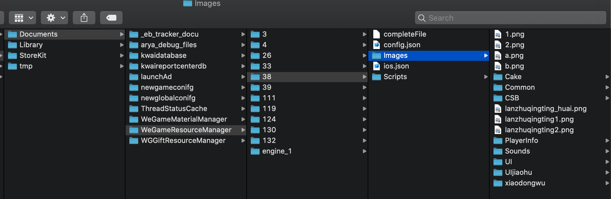

# 快手电丸

用户界面基于UIKit开发，游戏基于cocos2d开发。

小游戏点击图标直接下载资源并开始，大游戏基于Cocos Creator创建会弹出新窗口并开始游戏。

## IPA文件
每个游戏有一个bundle，打在了mainBundle里如下图：

下图是Kwai_2048.bundle的截图，里面是格式不明的gc文件，从文件命名看是游戏相关组件，无资源

## 沙盒Document文件夹
点击游戏时会通过WeGameResourceManager下载游戏资源到这个文件夹下，这个文件夹下对应的数字文件夹名是游戏ID

